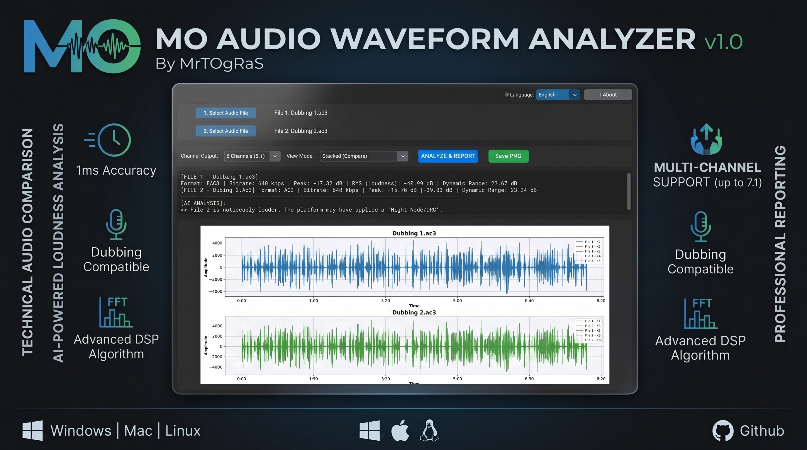

# 🎵 MO Audio Waveform Analyzer v1.0

**Statistical waveform comparison tool for dubbed & multi-track audio**

[](https://python.org)
[](https://github.com/MrTOgRaS/MOAudioWaveformAnalyzer/releases)
[](LICENSE)
[](https://github.com/MrTOgRaS/MOAudioWaveformAnalyzer/releases)
[](https://github.com/MrTOgRaS/MOAudioWaveformAnalyzer/releases)

[**🇬🇧 English**](#-english) · [**🇹🇷 Türkçe**](#-türkçe)

[](assets/MOAudioAnalyzer.jpg)

---

## 🇬🇧 English

> **MO Audio Waveform Analyzer** compares the peak level, loudness (RMS), and dynamic range of two audio tracks — side by side, channel by channel — and tells you in plain language how they differ. Built for checking dub masters, streaming-platform re-encodes, and multi-channel (up to 7.1) movie/TV audio against each other.

### ✨ Features

| | Feature | Description |
| --- | --- | --- |
| 📊 | **Peak / RMS / Dynamic Range** | Precise loudness & dynamic-range statistics for one or two files |
| 🎙️ | **EBU R128 / LUFS** | Integrated Loudness + True Peak (dBTP, via 2x oversampling), the same standard Netflix/EBU deliverables require |
| 🌈 | **Spectrogram View** | Frequency-vs-time view to spot codec-related high-frequency cutoff or pitch differences between two files |
| 🤖 | **Automatic Comparison** | Flags loudness gaps, dynamic-range differences, and possible DRC/"Night Mode" between two masters |
| 📈 | **3 View Modes** | Overlay, Stacked, or Per-Channel waveform charts |
| 🎚️ | **Up to 7.1 Channel Output** | Mono / Stereo / 5.1 / 7.1 extraction and analysis |
| 🎞️ | **Wide Format Support** | MKV, MP4, AC3, EAC3, AAC, MP3, FLAC, WAV — via FFmpeg |
| ⚡ | **Non-Blocking Analysis** | Runs on a background thread — the UI never freezes, even on full-length movies |
| 🌍 | **Trilingual UI** | English / Türkçe / Deutsch, one-click switch |
| 🔄 | **Update Checker** | Built-in "Check for Updates" from the About window |
| 💾 | **PNG Export** | Save the generated waveform chart |

---

### 📥 Installation

**Option 1 — Portable EXE (recommended):**

Download `MOAudioWaveformAnalyzer.exe` from [**Releases**](https://github.com/MrTOgRaS/MOAudioWaveformAnalyzer/releases) — single file, no installation needed.
> ⚠️ Windows SmartScreen may show a warning on first run. Click **"More info" → "Run anyway"**.

**Option 2 — Run from source:**

```
git clone https://github.com/MrTOgRaS/MOAudioWaveformAnalyzer.git
cd MOAudioWaveformAnalyzer

pip install -r requirements.txt

python waveform_analyzer.py
```
> [FFmpeg](https://ffmpeg.org/download.html) must be installed and available on your `PATH`.

To update dependencies to their latest versions later:
```
pip install --upgrade -r requirements.txt
```

**Option 3 — Build the EXE yourself:**

Run `build.bat` (or `build.bat upgrade` to also update dependencies first), or see [`README_BUILD.txt`](README_BUILD.txt) for the manual PyInstaller command and how the [GitHub Actions](.github/workflows/build.yml) auto-build works.

### 🚀 Usage

1. Select **File 1** (and optionally **File 2** to compare it against)
2. Choose the **channel output** (Mono / Stereo / 5.1 / 7.1) and **view mode** (Overlay / Stacked / Per-Channel)
3. Click **Analyze & Report**
4. Read the Peak / RMS / Dynamic Range numbers and the automatic comparison summary, or click **Save PNG** to export the chart

---

## 🇹🇷 Türkçe

[](assets/MOAudioAnalyzer.jpg)

> **MO Audio Waveform Analyzer**, iki ses dosyasının tepe seviyesini (Peak), gürlüğünü (RMS) ve dinamik aralığını — yan yana, kanal kanal — karşılaştırır ve aradaki farkı sade bir dille özetler. Dublaj masterlarını, platform yeniden kodlamalarını ve çok kanallı (7.1'e kadar) film/dizi ses dosyalarını birbiriyle kıyaslamak için tasarlandı.

### ✨ Özellikler

| | Özellik | Açıklama |
| --- | --- | --- |
| 📊 | **Peak / RMS / Dinamik Aralık** | Tek ya da iki dosya için hassas gürlük ve dinamik aralık istatistikleri |
| 🎙️ | **EBU R128 / LUFS** | Bütünleşik Gürlük + True Peak (dBTP, 2x aşırı örnekleme ile) - Netflix/EBU teslim spesifikasyonlarının istediği aynı standart |
| 🌈 | **Spektrogram Görünümü** | İki dosya arasında codec kaynaklı yüksek frekans kesilmesi veya pitch farkını gözle görünür kılan frekans-zaman görünümü |
| 🤖 | **Otomatik Karşılaştırma** | İki master arasındaki gürlük farkını, dinamik aralık farkını ve olası DRC/"Gece Modu" uygulamasını tespit eder |
| 📈 | **3 Görünüm Modu** | Üst Üste Bindir, Alt Alta Çiz veya Kanal Kanal dalga formu grafikleri |
| 🎚️ | **7.1'e Kadar Kanal Çıktısı** | Mono / Stereo / 5.1 / 7.1 çıkarma ve analiz |
| 🎞️ | **Geniş Format Desteği** | MKV, MP4, AC3, EAC3, AAC, MP3, FLAC, WAV — FFmpeg ile |
| ⚡ | **Arayüzü Dondurmayan Analiz** | Arka plan thread'inde çalışır — tam uzunluktaki filmlerde bile arayüz kilitlenmez |
| 🌍 | **Üç Dilli Arayüz** | İngilizce / Türkçe / Almanca, tek tıkla geçiş |
| 🔄 | **Güncelleme Kontrolü** | Hakkında penceresinden dahili "Güncellemeleri Kontrol Et" |
| 💾 | **PNG Olarak Dışa Aktarma** | Üretilen dalga formu grafiğini kaydet |

### 📥 Kurulum

**Seçenek 1 — Portable EXE (önerilen):**

[**Releases**](https://github.com/MrTOgRaS/MOAudioWaveformAnalyzer/releases) sayfasından `MOAudioWaveformAnalyzer.exe` dosyasını indirin — tek dosya, kurulum gerektirmez.
> ⚠️ İlk çalıştırmada Windows SmartScreen uyarısı gösterebilir. **"Daha fazla bilgi" → "Yine de çalıştır"** tıklayın.

**Seçenek 2 — Kaynak koddan çalıştırma:**

```
git clone https://github.com/MrTOgRaS/MOAudioWaveformAnalyzer.git
cd MOAudioWaveformAnalyzer

pip install -r requirements.txt

python waveform_analyzer.py
```
> [FFmpeg](https://ffmpeg.org/download.html) sisteminizde kurulu ve `PATH`'te olmalıdır.

Paketleri daha sonra en son sürüme yükseltmek için:
```
pip install --upgrade -r requirements.txt
```

**Seçenek 3 — Exe'yi kendiniz derleyin:**

`build.bat`'i çalıştırın (paketleri önce güncellemek için `build.bat upgrade`), ya da elle PyInstaller komutu ve [GitHub Actions](.github/workflows/build.yml) otomatik derleme akışı için [`README_BUILD.txt`](README_BUILD.txt) dosyasına bakın.

### 🚀 Kullanım

1. **Dosya 1**'i seçin (isteğe bağlı olarak kıyaslamak için **Dosya 2**'yi de seçin)
2. **Kanal çıktısını** (Mono / Stereo / 5.1 / 7.1) ve **görünüm modunu** (Üst Üste / Alt Alta / Kanal Kanal) seçin
3. **Analiz Et ve Raporla**'ya tıklayın
4. Peak / RMS / Dinamik Aralık değerlerini ve otomatik karşılaştırma özetini okuyun, ya da grafiği dışa aktarmak için **PNG Kaydet**'e tıklayın

---

### 🛠️ Built With

`NumPy` · `Matplotlib` · `CustomTkinter` · `Pillow` · `FFmpeg` · `Tkinter`

---

[](https://mrtogras.com/support/)

**Developer:** [Murat Oğraş](https://www.mrtogras.com) · [GitHub](https://github.com/MrTOgRaS) · [Email](mailto:destek@mrtogras.com)

**License:** [MIT](LICENSE)
